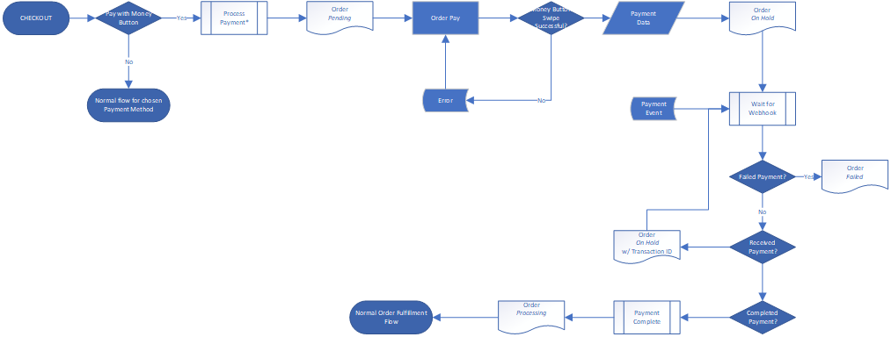

# Plugin Users

## Prerequisites

- You need a Money Button account https://www.moneybutton.com
  - Need to add a new app, which you can do when logged in at https://www.moneybutton.com/settings/apps
- Versions - TBD
  - PHP 7.1+
  - WooCommerce 3.3+
  - WordPress 4.9, 5+


## Plugin Installation

### Manual Installation

:warning: Always backup your WordPress installation (including database) before installing or updating plugins.


This process may vary depending on your hosting provider, but basically:

1. Download latest release from https://github.com/brightnet-io/wc-gateway-moneybutton/releases

2. Unzip the plugin files

3. Connect to your server with your favourite FTP client

4. Find your WordPress installation and navigate to the wp-content/plugins directory

5. Upload the entire  `wc-gateway-moneybutton` directory from your unzipped files to wp-content/plugins.

6. Navigate to "Plugins"->"Installed Plugins" in your wp-admin 

7. Find the "Money Button Payment Gateway for WooCommerce" plugin and activate it.

8. Use the "Gateway Settings" link for the plugin to configure your settings.

   

## Gateway Settings

| Setting           | Description                                                  | Hint                                                         |
| ----------------- | ------------------------------------------------------------ | ------------------------------------------------------------ |
| Title             | This is what is shown during checkout as the payment option. | Money Button                                                 |
| Send To           | This is where payments will be made to. It can be one of, a) Money Button User Id, or b) a valid BSV address. Note that at this time using a paymail address only works if the customer/client user is already logged in to Money Button. For this reason we recommend you do not use a paymail address in this field.
| Button Label      | This is the label text that appears *inside* the Money Button when it is displayed. | Pay Now                                                      |
| Button Id         | The Button ID is an identifier submitted with the payment data. Or, put simply, 'where did this payment come from'.It will be displayed prominently on incoming payments in your Money Button details to help you identify the source of payment. | Using alpha numeric characters and replacing spaces with _ or - may be of benefit if/when filter and searching tools become available. |
| Client Identifier | The unique Client Identifier of the App you created on your Money Button account.  It is part of the data required to correctly render the Money Button | https://www.moneybutton.com/settings/apps                    |
| Webhook Secret    | The Webhook Secret you set on the app you created on your Money Button account. When Money Button sends a payment notification back to your site, it includes this secret as a mechanism to verify the data is actually coming from Money Button. | https://www.moneybutton.com/settings/apps                    |
| Dev Mode          | In dev mode the Money Button will be simulated when you swipe, and it will always be successful. In addition, when logged in as an admin, additional buttons will be rendered on the order pay screen to produce different simulated results. | There is really no need to turn this on unless you are actually making code changes to the plugin itself. |
| Debug Logging     | Verbose logging via WooCommerce Logger for debugging only.   | Do not enable this.                                          |

### Cautions and Warnings

_Split/Partial Payments not supported_

The gateway does not support split or partial payments either between payment methods or separate Money Button payments. It does however support making another payment attempt with an entirely new Payment ID if the initial payment fails. Currently the meta-box in the order admin screen will show only the most recent / in-flight payment, however details of the failed payment attempt will still be in the order notes.


## Basic Flow




Important Note: Due to the nature of blockchain payments, the plugin will reserve inventory / reduce order stock when the customer progresses from place order to order pay, ie: stock is already reduced for an order when it is in 'pending payment'. This is to prevent out of stock scenarios, after a payment has been successfully submitted. 

Unlike credit card gateways, blockchain payments do not have an AUTH -> CAPTURE sequence where a merchant can simply release the AUTH  (or not issue the CAPTURE) in an *out-of-stock* or order cancelled  scenario. 

If the customer makes the payment with Money Button, and then items are out of stock, or they cancel the order, you have to wait for the payment to complete, and then send the money back. A payment that is pending/received but not completed when an order is cancelled *cannot* be interrupted.


# Developers

1. Fork repo
2. Clone fork
3. ```npm install```
4. ```composer install```
5. Run unit ```npm run test``` and integration ```npm run integration``` tests
6. In a separate terminal start webpack for asset builds ```npm run watch```
7. Fire up docker ```docker-compose up```
8. Have at it.

Note 1: composer install may take a while as ```composer.json``` inlcudes wp-develop and woocommerce source repositories that are used in running the integration tests.

Note 2: If you are using IDEA Ultimate/PHPStorm you may also need to right click and select "composer"->"update" after the install. But probably only if you intend to run the PHP Unit tests inside the ide.

Note 3: For now src/integration-test/wp-tests-config.php,  is committed and contains the DB connection settings when running integration tests. These settings will vary so should be moved out of the committed file.


